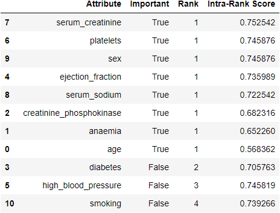
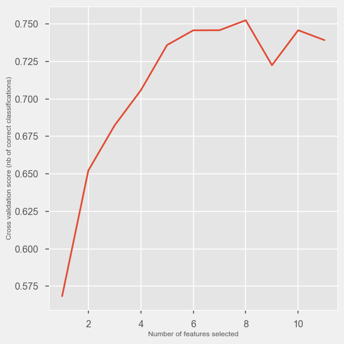

# Heart Failure | An Early Warning ML Application

---
## Background & Challenge

[According to the Centers for Disease Control](https://www.cdc.gov/nchs/fastats/leading-causes-of-death.htm) and Preventions’ National Center for Health Statistics, heart disease is the most common cause of death in the United States. Cardiovascular diseases (CVDs) are the number 1 cause of death globally, taking an estimated 17.9 million lives each year, which accounts for 31% of all deaths worldwide. Heart failure is a common event caused by CVDs and this dataset contains 12 features that can be used to predict mortality by heart failure.

[Link to Heroku Application](https://heart-failure-detection.herokuapp.com/)

---
## Potential Use Case

The use case of this project is to help warn medical professionals and patients of a potential heart failure event by developing a robust classification model and deploying that model to an interactive portable application.

The data source for model developement may be found on Kaggle [here](https://www.kaggle.com/andrewmvd/heart-failure-clinical-data).

---
## Application Development Toolkit

>* Python
>* SciKit Learn
>* Pandas
>* Matplotlib
>* Seaborn
>* Flask API
>* MongoDB
>* JavaScript
>* JQuery
>* d3.js
>* GitBash
>* GitHub
>* HTML
>* CSS
>* [Gif Generator](https://gifcap.dev/)
>* Heroku

---
## Exploratory Data Analysis Overview

**Attributes**

Age – Age of patient in years

Anemia – Binary classifier for pre-existing condition

Creatine Phosphokinase - Level of the CPK enzyme in the blood (mcg/L)

Diabetes - Binary classifier for pre-existing condition

Ejection Fraction - Percentage of blood leaving the heart at each contraction (percentage)

High Blood Pressure - Binary classifier for pre-existing condition

Platelets - Platelets in the blood (kiloplatelets/mL)

Serum Creatine - Level of serum creatinine in the blood (mg/dL)

Serum Sodium - Level of serum sodium in the blood (mEq/L)

Sex - Binary classifier for gender

Smoking - Binary classifier for pre-existing condition

Time* – Follow up period in days from test panel (*omitted from analysis)

Death Event – Binary classifier for target event

---
**Attribute Correlation Map**

**Data Balance Check**

---
## Model Selection

* Ten standard skLearn classification models evaluated with default parameters for a high-level model selection process

* Random Forest Model selected based upon consistent performance with multiple data splits

* Additional model research could be performed with Keras/TensorFlow in the future

---
## Feature Selection
* Recursive Feature Elimination Cross-Validation*

* Cross-Validation Score*

*Example Iteration of Probabilistic Solver with 5-fold Cross-Validation

* MDI – Mean Decrease in Impurity
    * Deterministic feature selection

* Correlates well with probabilistic RFECV feature selection modeling

* Feature importance aligns with original study of attribute importance:
    * Serum Creatine
    * Ejection Fraction

---
## Hyper Parameter Tuning

**Model Evalution with Default Parameters**

**Model Evalution with Hyper Parameter Tuning and Feature Selection**

---
# Application Screenshot

